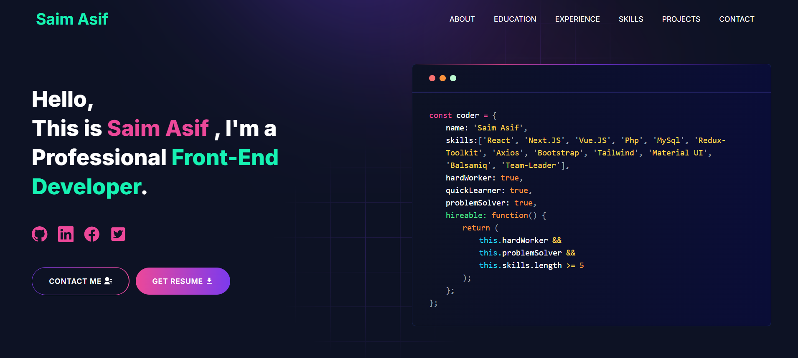

# Developer Portfolio

### Are you struggling to create a professional portfolio website? Look no further! You can use the Developer Portfolio template and create your very own personalized portfolio today! My website is designed to be user-friendly and easily customizable, making it perfect for both developers and freelancers.

---

# Demo :movie_camera:



## View live preview [here](https://66bf18f24e5489e8ee8cef10--saimasifportfolio.netlify.app/).

---

## Table of Contents :scroll:

- [Sections](#sections-bookmark)
- [Demo](#demo-movie_camera)
- [Packages Used](#packages-used-package)

---

# Sections :bookmark:

- HERO SECTION
- ABOUT ME
- EXPERIENCE
- SKILLS
- PROJECTS
- EDUCATION
- CONTACTS

---


#### Make sure you have the latest version of both Git and Node on your computer.

```
node --version
git --version
```

## <br />


### Install packages from the root directory

```bash
npm install
# or
yarn install
```

Then, run the development server:

```bash
npm run dev
# or
yarn dev
```

Open [http://localhost:3000](http://localhost:3000) with your browser to see the result.

---


### Then, Customize data in the `utils/data` [folder](https://github.com/said7388/developer-portfolio/tree/main/utils/data).

Eg:

```javascript
export const personalData = {
  name: "Saim Asif",
  profile: "/profile.png",
  designation: "Full-Stack Software Developer",
  description: "My name is Saim Asif",
  email: "saimasif885@gmail.com",
  phone: "+923081808805",
  address: "Okara,Punjab",
  github: "https://github.com/dev-saim",
  facebook: "https://www.facebook.com/saim.asif.925/",
  linkedIn: "https://www.linkedin.com/in/saim-asif-8181aa1aa",
  devUsername: "dev_saim",
};


# Packages Used :package:

| Used Package List  |
| :----------------: |
|        next        |
|  @emailjs/browser  |
|    lottie-react    |
| react-fast-marquee |
|    react-icons     |
|   react-toastify   |
|        sass        |
|    tailwindcss     |

---
